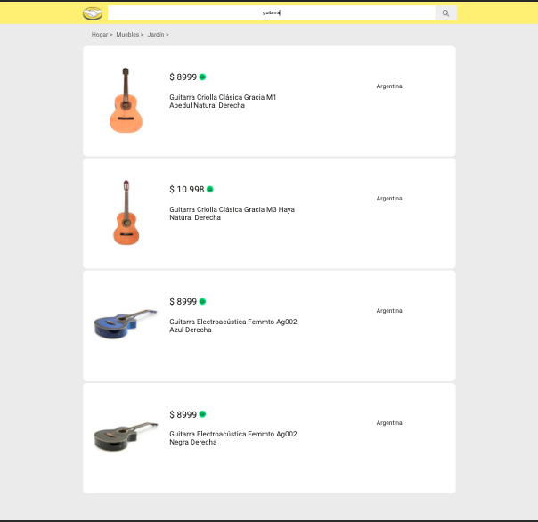
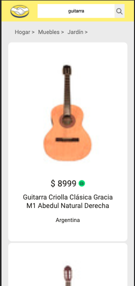
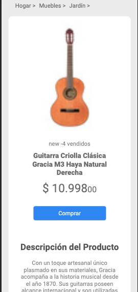
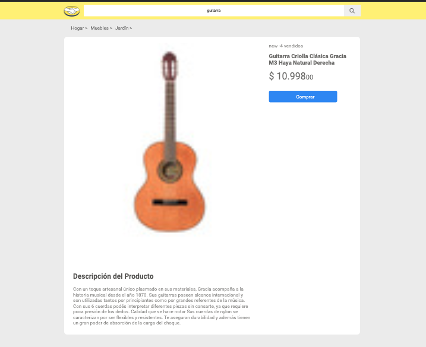

#  MELI SEARCHBAR





​
## Overview
It is a project based in the searchBar of MeLi web page.
The user input a word and it is seached on the MeLi public API through tow end-points created by express. Express serves this end-points to the front-end sending the first 4 results.
The usar can click the item and watch a datail of the product.
The stack of the application; ReactJS, ExpressJS and Sass. BEM Style methodology. Features Git workflow.
​
​
## Requeriments

*En la vista de caja de búsqueda, debería poder ingresar el producto a buscar y al enviar el formulario navegar a
la vista de Resultados de búsqueda, visualizando solo 4 productos. Luego, al hacer clic sobre uno de ellos, debería navegar a la vista de Detalle de Producto.
* Dado un id de producto, debería poder ingresar directamente a la vista de detalle de producto.

​
​## Table of Contents

- [Installation](#installation)
- [Features](#features)
- [Components](#components)
- [Contributing](#contributing)
- [Team](#team)
- [Support](#support)
- [License](#license)


---

## Installation

On Terminal
* Clone the repository:
  ```
  git clon https://github.com/Charliemur2/meli_test.git
  ```
* Run The end-points:
  ```
  cd server/
  node app.js
  ```
* Run the App:
  ```
  cd client
  npm start
  ```
The serve will run on port http://localhost:8081 and the app on port http://localhost:3000.

## Features
* SearchBar
* Results
* Detail Page

## Components
* App
* BreadCrumb
* BreadItem
* FreeShipping
* Loader
* ProductDetail
* ProductItem
* Results
* SearchBox

## Contributing

> To get started...

### Step 1

- **Option 1**
    - 🍴 Fork this repo!

- **Option 2**
    - 👯 Clone this repo to your local machine using 

### Step 2

- **HACK AWAY!** 🔨🔨🔨

### Step 3

- 🔃 Create a new pull request using. 
---

#### Follow me ��
​
| Authors | GitHub | Twitter | Linkedin |
| :---: | :---: | :---: | :---: |
| Carlos Andres Murcia Muñoz | [Charliemur2](https://github.com/Charliemur2) | [@charliesoka](https://twitter.com/charliesoka?lang=es) | [Carlos Andres Murcia Muñoz](https://www.linkedin.com/in/carlos-andres-murcia-munoz/) |
---

## Support

---

## License

Free Source Code

##### May, 2021.
